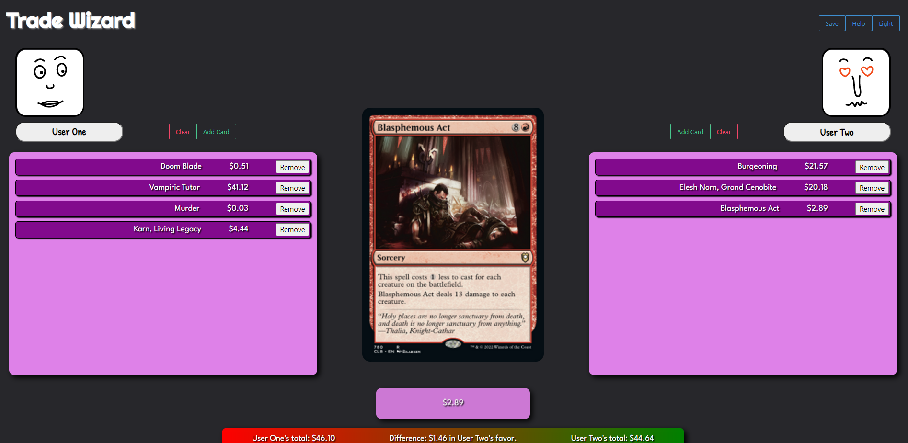
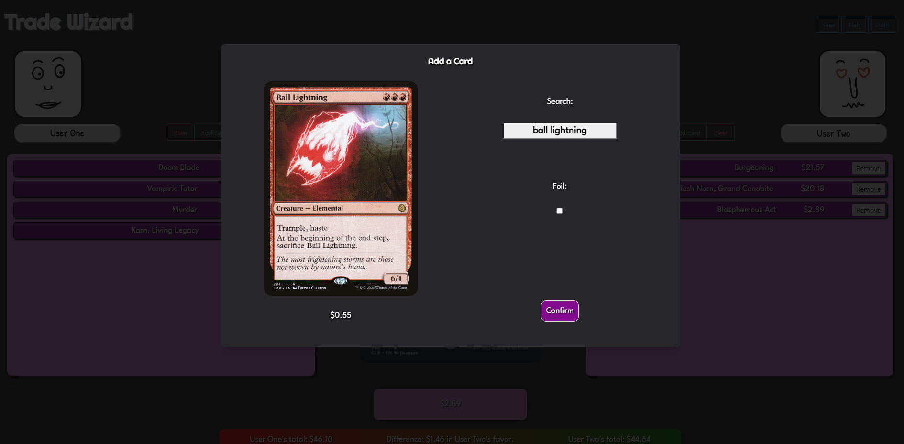

# Trade Wizard

## Description
[Trade Wizard](https://sullisters.github.io/Trade-Wizard/) is an app intended to make it easy and efficient for people to trade Magic The Gathering playing cards.

## Installation
N/A

## Usage
Trade Wizard enables two different people to search, save, and compare Magic The Gathering trading cards. This is done through typing in a card name, confirming the card, and having it appear on a list which is generated on the individuals respective sides of the trade. Once these lists are complete, users view the total/difference between their cards, and can then save their trade to local storage. 

## Examples

Example of what a trade might look like.

Example of a user adding a card to the trade.

## Credits
Joe Dixon, Philip Schreiber, Esther Franco, Andrew Massey

## License
Refer to the repository for licensing.
